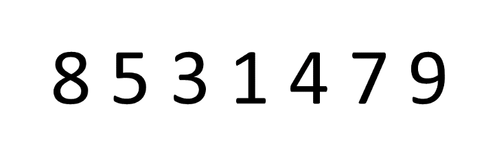
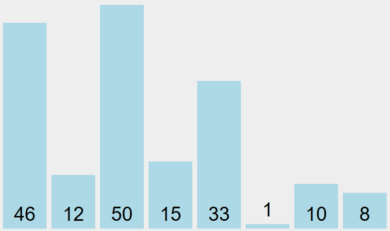
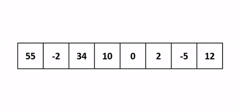
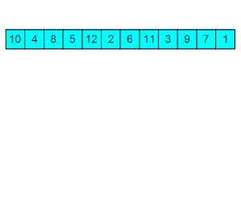

# **TP - Algorithmes de tri**

 

## **I) Objectif du TP**

 

L'objectif de ce TP est d'implémenter 4 algorithmes de tri (le tri à bulle, le tri par sélection, le tri par insertion et le tri par tas) afin de les confronter et de déterminer l'algorithme le plus efficace par rapport à la taille d'un tableau.  
 
 
 

## *Tri à bulle*

 

- Le tri à bulle consiste à parcourir un tableau et de comparer les éléments consécutivement, lorsque 2 éléments consécutifs ne sont pas dans l'ordre alors ils sont échangés.
 

 
 
 

## *Tri par sélection*

 

- Le tri par sélection consiste à rechercher l'élément le plus petit du tableau et de l'échanger avec l'indice 0. Ensuite, on réitère cette opération avec le second élement le plus petit du tableau afin de l'échanger avec l'indice 1 du tableau et ainsi de suite.
 
 
 
 
 

## *Tri par insertion*

 

- Le tri par insertion navigue sur chacun des éléments à trier puis l'insère directement à la place ou il devrait être. Pour l'insertion on compare l'élément courant avec chaque élément déjà trié sur la gauche.
 
 
 
 
 

## *Tri par tas*

 

- Le tri par tas consiste à voir le tableau comme un arbre binaire. Le premier élément est la racine, le seconde et le troisième sont les deux descendants du premier élément et ainsi de suite. Afin d'effectuer ce tri il faut que chaques noeuds possèdent une valeur supérieur à celles de ses 2 fils. Il en découle que la racine du tas contient la valeur maximale de l'arbre.  
 
 
 
 

## **II) Les différentes commandes**

 

## *Éxécution du programme*

 

Afin d'éxécuter le programme et de mettre à jour le fichier .csv, vous devez simplement lancer le programme via la touche `F5` de votre clavier ou via le terminal en lancant le fichier `main.c`. 
Grâce à ca vous pourrez voir les résultats des tests que vous venez d'effectuer.

 
 
 

## *Génération de la documentation*

 

Pour générer la documentation du projet, lancez un terminal et exécutez la commande `make documentation`. 
Afin de consulter la documentation générée il vous faudra exécuter la commande suivante : `firefox /Chemin_Absolu_Du_Répertoire_Du_Projet/ProjetC---Benchme/html/index.html`. 
Si vous n'y parvenez pas avec la commande précédente il vous faudra ouvrir le dossier "html" présent dans le répertoire du projet, puis de lancer le fichier "index.html". 
Si le code est amené à évoluer avec de nouveaux algorithmes de tris, il ne faut pas oublier d'effectuer la commande `make documentation` afin de garder la documentation du projet à jour.

 
 
 

## **III) Résultats attendus**

 

- Le programme doit générer des tableaux contenants respectivement 100, 10³, 10⁴, 10⁵, 10⁶ et 10⁷ valeurs puis ces tableaux doivent contenir des valeurs aléatoires comprises entre 0 et 10⁶. 
- Les différents algorithmes de tri doivent retourner les tableaux triés, pendant ce temps on récupère leur temps d'éxécution permettant d'établir les temps moyens des algorithmes. 
- Tous les temps moyens sont récupérés dans un fichier .csv créé à la fin de l'éxécution du programme afin de savoir l'algorithme le plus efficace pour chaque tableaux.

 
 
 

## **IV) Évolution à venir**

 

- Optimisation potentiel des différents algorithmes du TP
- Implémentation de nouveaux algorithmes de tri
 
 
 

## **V) Auteurs**

 

- **JANVIER Pierre** _alias_ [@p.janvier](https://gitlab.com/p.janvier) | [@p-janvier](https://github.com/p-janvier)
- **SAPY Oscar** _alias_ [@OSapy](https://github.com/OSapy/)
